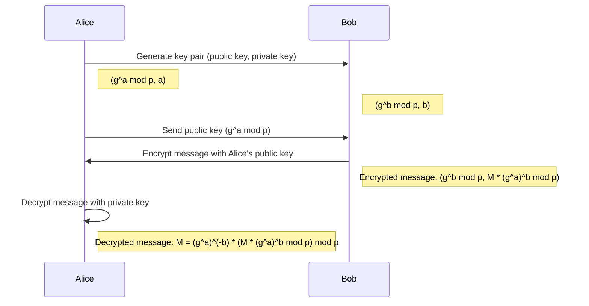

+++
title = "Unlocking the Power of ElGamal Encryption: Implementing and Enhancing Security with SageMath"

[taxonomies]
tags = ["ElGamal", "SageMath Implementation", "Public Key Cryptography", "Discrete Logarithm Problem", "ElGamal Key Generation", "ElGamal Encryption and Decryption", "Secure Communication with ElGamal", "Enhancing ElGamal Security", "sagemath" ]

+++

- [Introduction](#introduction)
- [ElGamal Encryption](#elgamal-encryption)
- [Enhancing Security of ElGamal Encryption](#enhancing-security-of-elgamal-encryption)
- [Finding a Safe Generator](#finding-a-safe-generator)
- [Practical Applications of ElGamal Encryption](#practical-applications-of-elgamal-encryption)
- [Conclusion](#conclusion)


# [Introduction](#introduction) 

ElGamal encryption is a widely-used public key encryption algorithm that provides confidentiality and security in communication systems. It was proposed by Taher ElGamal in 1985 and is based on the Diffie-Hellman key exchange protocol. In this guide, I will walk through the key components of the ElGamal encryption scheme, including key generation, encryption, and decryption. I will also demonstrate how to implement the algorithm using the SageMath software and enhance the security of the system by using a 256-bit random prime number.

# [ElGamal Encryption](#elgamal-encryption)

Key Components The ElGamal encryption scheme consists of three main components:
- Key Generation: The process of generating a pair of public and private keys for the encryption and decryption process.
- Encryption: The process of transforming plaintext into ciphertext using the public key.
- Decryption: The process of recovering the plaintext from the ciphertext using the private key.

In ElGamal encryption, the public key is used for encrypting the message, while the private key is used for decrypting it. The security of the ElGamal encryption scheme is based on the difficulty of solving the discrete logarithm problem.

Let's consider an example of the ElGamal encryption process:

- Alice and Bob agree on a large prime number $p$ and a primitive root $g modulo p$.
- Bob chooses a random private key $x$ and computes his public key $Y = g^x mod p$.
- Alice wants to send a message $M$ to Bob. She chooses a random integer $k$ and computes the ciphertext $(a, b) = (g^k mod p, M * Y^k mod p)$.
- Bob receives the ciphertext and decrypts it using his private key: $M = b * a^(-x) mod p$.

**Flow of the ElGamal encryption**

Here is the complete flow diagram of ElGamal encryption.




Implementing ElGamal Encryption with SageMath SageMath is an open-source mathematics software that provides a powerful environment for implementing various cryptographic algorithms, including ElGamal encryption. To get started with SageMath, you can install it on your local machine or use the online version available at sagemath.org.

Once you have SageMath installed and running, you can implement the ElGamal encryption process as follows:

```python
   from sage.all import *

   # Key Generation
   p = 23  # Prime number
   g = 5   # Generator
   x = 6   # Bob's private key
   Y = power_mod(g, x, p)  # Bob's public key

   # Encryption (Alice)
   M = 12  # Message
   k = 3   # Random value
   a = power_mod(g, k, p)
   b = (power_mod(Y, k, p) * M) % p

   # Decryption (Bob)
   M_decrypted = (b * power_mod(a, -x, p)) % p

   print("Original message:", M)
   print("Encrypted message:", (a, b))
   print("Decrypted message:", M_decrypted)
```

This example demonstrates the basic ElGamal encryption process with a fixed prime number $p$. The output shows the original message, the encrypted message, and the decrypted message.

# [Enhancing Security of ElGamal Encryption](#enhancing-security-of-elgamal-encryption)

Choosing a 256-bit Random Prime Using large prime numbers in the ElGamal encryption process is crucial for ensuring the security of the system. Larger prime numbers make it more difficult for an attacker to solve the discrete logarithm problem, which is the basis of the ElGamal encryption scheme's security.

To generate a 256-bit random prime number in SageMath, you can use the `random_prime()` function:

```python
   p = random_prime(2^256, lbound=2^255, proof=False)  # 256-bit prime number
```
By updating the previous SageMath code with this new prime number generation method, you can enhance the security of the ElGamal encryption process.

# [Finding a Safe Generator](#finding-a-safe-generator)

In the ElGamal encryption scheme, selecting a safe generator $g$ is crucial for the security of the system. A safe generator is a number that generates a cyclic subgroup of the multiplicative group $modulo p$, where $p$ is a large prime number. 

To find a safe generator $g$, follow these steps:

1. First, select a large prime number $p$ and compute $(p-1)/2$, which should also be prime. This new prime number is denoted as $q$.
2. Now, choose a random number $g$ from the set ${2, 3, ... , p-2}$.
3. Calculate $(g^q) mod p$. If the result is not equal to 1, then g is a safe generator.

Here's an example of how to find a safe generator using SageMath:

```python
# Find a safe generator $g$ for a given prime $p$
def find_safe_generator(p):
    q = (p - 1) // 2
    g = 2
    while True:
        if power_mod(g, q, p) != 1:
            return g
        g += 1

# Example: Finding a safe generator for a 256-bit prime number
p = random_prime(2^256, 2^255)
g = find_safe_generator(p)
print("Safe generator (g):", g)
```

By following this method, you can ensure that the chosen generator $g$ is safe and suitable for use in the ElGamal encryption scheme.

# [Practical Applications of ElGamal Encryption](#practical-applications-of-elgamal-encryption) 

ElGamal encryption has numerous practical applications, including:

- Secure communication: ElGamal encryption can be used to ensure confidentiality in communication systems, such as email and instant messaging.
- Digital signatures: ElGamal encryption can be adapted for use in digital signature schemes, providing integrity and non-repudiation for electronic documents and transactions.
- Key exchange: ElGamal can be used as a key exchange protocol, allowing two parties to establish a shared secret key over an insecure channel.
- Secure voting systems: ElGamal encryption can be employed in secure electronic voting systems to maintain voter privacy and ensure that votes are accurately counted.

Despite its benefits, ElGamal encryption has some limitations that should be considered when choosing a cryptographic solution:

- Computational complexity: ElGamal encryption and decryption require modular exponentiation operations, which can be computationally expensive, especially for large prime numbers.
- Message expansion: The ciphertext in ElGamal encryption consists of two elements, resulting in a message expansion factor of two compared to the original plaintext size.
- Lack of built-in authentication: ElGamal encryption does not provide built-in message authentication or integrity checking, which may require additional mechanisms to ensure data integrity.

# [Conclusion](#conclusion)

In this article, I have provided an in-depth explanation of ElGamal encryption and its key components, including key generation, encryption, and decryption. I have also demonstrated how to implement the ElGamal encryption algorithm using SageMath and enhance the security of the system by using a 256-bit random prime number.

ElGamal encryption is an essential tool in the field of cryptography, with numerous practical applications in secure communication, digital signatures, key exchange, and secure voting systems. However, it is crucial to consider its limitations and choose the most suitable encryption scheme for your specific needs.

I encourage you to experiment with ElGamal encryption using SageMath and explore its potential in various applications. By understanding the fundamentals of ElGamal encryption and its implementation, you can build more secure and robust cryptographic systems.

You can find the full code in the github repo [github.com/thogiti](https://github.com/thogiti/ElGamal-Encryption/blob/main/ElGamal-Encryption.sage).

**References**
1. ElGamal, T. (1985). A public key cryptosystem and a signature scheme based on discrete logarithms. IEEE Transactions on Information Theory, 31(4), 469-472.
2. Diffie, W., & Hellman, M. E. (1976). New directions in cryptography. IEEE Transactions on Information Theory, 22(6), 644-654.
